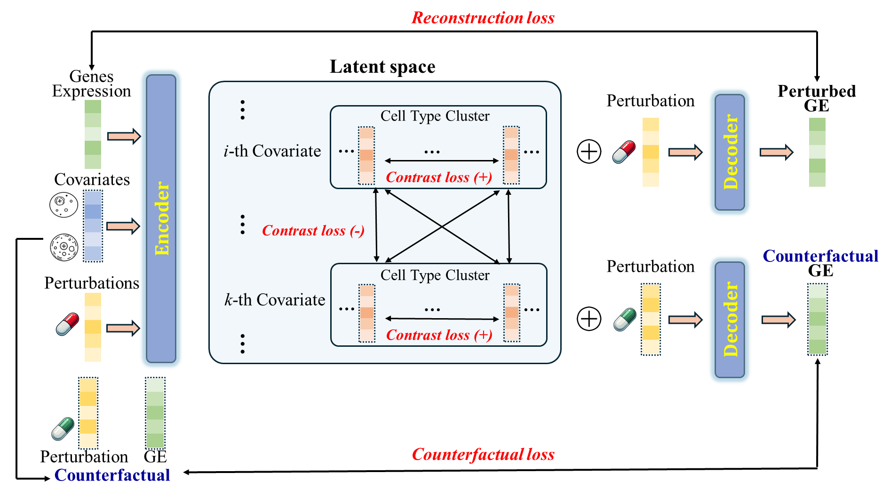
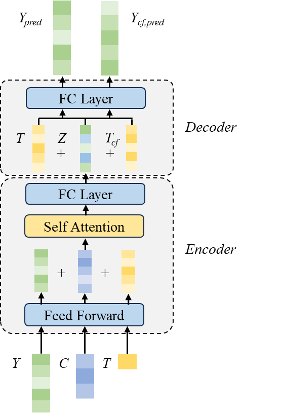

# scCADE
scCADE: A Superior Tool for Predicting Perturbation Responses in Single-Cell Gene Expression Using Contrastive Learning and Attention Mechanisms

### Workflow
<p align="center">
  
</p>

### Architecture
<p align="center">
  
</p>


## Environment
### The version information in use: Python 3.8.18, Pytorch 2.3.0


## Run

Visit [resource site](https://osf.io/5n2mz/), download the contents of `main/datasets` into [datasets](datasets) 


Once the environment is set up and the contents are prepared, the function call to train scCADE is:

```bash
./main.sh &
```

A list of flags may be found in `main.sh` and `main.py` for experimentation with different hyperparameters. The run log and models are saved under `/saves`, and the tensorboard log is saved under `/runs`.

## License

Contributions are welcome! All content here is licensed under the MIT license.
